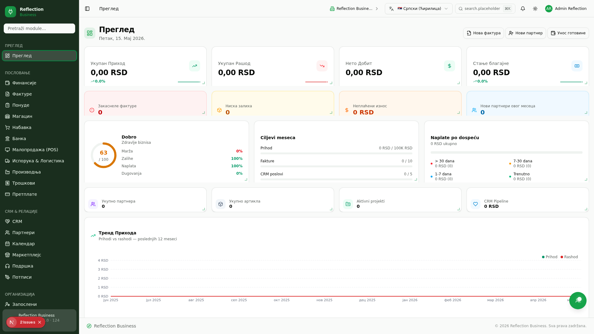

<div align="center">

# 🔷 Reflection Business ERP

**Kompletni poslovni ERP + CRM sistem** — 124 modula, 180 Prisma modela, 163 API rute

[](https://nextjs.org/)
[](https://www.typescriptlang.org/)
[](https://tailwindcss.com/)
[](https://www.prisma.io/)
[]()
[](https://bun.sh/)

</div>

---

## 📋 Opis / About

**Reflection Business** je sveobuhvatan ERP sistem izgrađen sa Next.js 16, dizajniran za upravljanje svim aspektima poslovanja — od finansija i HR-a do logistike i nekretnina. Sistem nudi 124 modula raspoređenih u 15 kategorija, sa podrškom za multi-tenant arhitekturu, temu po izboru, i AI-asistirane funkcionalnosti.

A comprehensive ERP system built with Next.js 16, designed to manage every aspect of business operations — from finance and HR to logistics and real estate. The system offers 124 modules across 15 categories, with multi-tenant architecture, theming, and AI-assisted features.

## 📸 Screenshot

<!-- Placeholder — replace with actual screenshot -->
<p align="center">
  
</p>

## ✨ Ključne funkcionalnosti / Features

- 🧩 **124 ERP modula** — raspoređenih u 15 kategorija pokrivaju sve poslovne procese
- 📊 **Drag-and-drop dashboard** — Grafana-style edit mode sa 26 widgeta, resizable i perspektivni
- 🏭 **99 industrijskih šablona** — predkonfigurisani moduli za fitnes, restorane, advokatske kancelarije, građevinarstvo i još mnogo toga
- 🖥️ **Desktop Mode** — OS-like layout sa prozorima, drag&drop, taskbar-om
- 🏢 **Multi-tenant podrška** — više kompanija, SuperAdmin uloga, kompanija-switcher
- 🌗 **Dark / Light tema** — automatski prema sistemskim podešavanjima ili ručno
- 🤖 **AI funkcionalnosti** — ChatBot, Business Team, AI Setup Wizard za brzu konfiguraciju
- 📱 **Responsivan dizajn** — mobile-first pristup, radi na svim uređajima
- 🔐 **RBAC permisije** — role-based pristup sa Permissions Editor-om
- 🔑 **API Key autentikacija** — za integracije sa spoljnim sistemima
- 📄 **eFakture** — generisanje SEF XML-a, EPC QR kodovi, PDV izveštaji
- 💬 **Forum & Chat** — internu komunikaciju za timove
- 🔄 **Automatizacija** — marketing automation rules, workflow engine

## 🚀 Brzi početak / Quick Start

### Preduvzeti / Prerequisites

- [Node.js](https://nodejs.org/) 20+
- [bun](https://bun.sh/) (package manager)

### Instalacija / Installation

```bash
# Kloniranje repozitorijuma
git clone <repository-url>
cd reflection-business-erp

# Instalacija zavisnosti
bun install

# Generisanje Prisma klijenta
bunx prisma generate

# Push šeme u SQLite bazu
bun run db:push

# Seedovanje početnih podataka
bunx prisma db seed

# Pokretanje development servera
bun run dev
```

Otvorite [http://localhost:3000](http://localhost:3000) u pregledaču.

## 🐳 Docker

### Produkcija / Production

```bash
# Pokretanje sa Docker Compose
docker compose up -d

# Podaci se čuvaju u ./data/ direktorijumu (SQLite persistence)
```

Postavite `JWT_SECRET` u `.env` fajlu pre pokretanja:

```env
JWT_SECRET=your-long-random-secret-key-here
```

### Development sa Docker-om

```bash
docker compose -f docker-compose.yml -f docker-compose.dev.yml up
```

Ovo montira izvorni kod kao volume za hot-reload development.

## 📁 Struktura projekta / Project Structure

```
reflection-business-erp/
├── src/
│   ├── app/
│   │   ├── api/              # 163 API ruta
│   │   ├── layout.tsx        # Root layout sa sidebar
│   │   ├── page.tsx          # Main page (SPA-like)
│   │   └── globals.css       # Global styles + Tailwind
│   ├── components/
│   │   ├── modules/          # 124 modul komponenti
│   │   │   ├── Dashboard/    # Drag-and-drop dashboard
│   │   │   ├── Invoices/     # Fakture + eFakture
│   │   │   ├── Contacts/     # Partneri/Klijenti
│   │   │   ├── Settings/     # Podešavanja + Namene
│   │   │   └── ...           # 120+ ostalih modula
│   │   └── ui/               # shadcn/ui komponente
│   └── lib/
│       ├── module-groups/    # Code-split grupa za lazy loading
│       ├── menuGroupsData.ts # Sidebar navigacija (124 modula)
│       ├── store.ts          # Zustand global state
│       ├── db.ts             # Prisma klijent
│       ├── rbac.ts           # Role-based pristup
│       ├── audit.ts          # Audit logging
│       └── i18n/             # Internacionalizacija (SR/EN)
├── prisma/
│   ├── schema.prisma         # 180 Prisma modela
│   └── seed.ts               # Seed podaci
├── db/
│   └── custom.db             # SQLite baza podataka
├── mini-services/            # Microservisi (websocket, sync)
├── Dockerfile                # Multi-stage Docker build
├── docker-compose.yml        # Produkcija konfiguracija
├── docker-compose.dev.yml    # Development override
└── next.config.ts            # Next.js konfiguracija
```

## 📦 Kategorije modula / Module Categories

| Kategorija / Category | Moduli / Modules | Primeri / Examples |
|---|---:|---|
| **Core / Jezgro** | 12 | Dashboard, Finansije, Fakture, Zalihe, Partneri, Kalendar, Dokumenta, Ponude, Troškovi, Automatizacija, Izveštaji, Podešavanja |
| **HR / Ljudski resursi** | 13 | Zaposleni, Rekrutacija, Odsustva, Veštine, Odobrenja, Planer radne snage, Posete, Predlozi, Praćenje vremena, Naplata vremena, Gamifikacija, Potpisi |
| **Finance / Finansije** | 12 | Knjigovodstvo, Banka, Plaćanja, Blagajna, POS, Pretplate, Ugovori, Nabavka, Povrat robe, Kuponi, Cenovnici |
| **Sales / Prodaja & CRM** | 14 | CRM, Helpdesk, Email marketing, SMS marketing, Društvene mreže, Marketing automatizacija, Ankete, Događaji, Lojalnost, Ocene, Preporuke, Žalbe |
| **Projects / Projekti** | 13 | Projekti, Osnovna sredstva, Održavanje, Proizvodnja, Kvalitet, Protokol, PLM, Standardi, Etikete, Barkod, Tenderi, Garancije |
| **IT / Informacioni tehnologije** | 12 | Chat, Baza znanja, Website, Blog, Forum, Spreadsheet, Beleške, Integracije, Backup, Zakoni, IoT, VoIP |
| **Logistics / Logistika** | 12 | Transport, Flota, Rent-a-car, Isporuka, Rute, Rampi, Carinski dokumenti, Kamioni, Pakovanje, Geolokacija, Marketplace, E-commerce |
| **Education / Obrazovanje** | 7 | Edukacija, Domaći zadaci, Upisi, Raspored, Biblioteka, Učionica, Školarina |
| **Healthcare / Zdravstvo** | 5 | Pacijenti, Zdravstveni kartoni, Recepti, Laboratorija, Zdravstveni fond |
| **Hospitality / Ugostiteljstvo** | 5 | Restoran, Rezervacije, Meni, Kuhinja, Narudžbine |
| **Construction / Građevina** | 5 | Građevinski dnevnik, Nacrte, Podizvođači, Merenja, Bezbednost |
| **Real Estate / Nekretnine** | 6 | Nekretnine, Zakupi, Pregledi, Komunalije, Radni nalozi, Procena |
| **Production / Proizvodnja+** | 3 | Radni nalozi, Standardi, Etikete |
| **Retail / Trgovina** | 8 | Barkod, Cenovnici, Kuponi, Recenzije, SEO, Plaćanja, Povrat robe, Kasa |
| **Services / Usluge** | 5 | Praćenje vremena, Naplata, Portal klijenata, Automatizacija, Filijale |
| **Analytics & System** | 5 | Izveštaji, Integracije, Zakoni, Podešavanja, Backup |

**Ukupno: 124 modula** · **180 Prisma modela** · **163 API rute**

## 🛠️ Tech Stack

| Tehnologija | Verzija | Namena / Purpose |
|---|---|---|
| **Next.js** | 16 | React framework (App Router, standalone output) |
| **TypeScript** | 5 | Type-safe razvoj |
| **Tailwind CSS** | 4 | Utility-first CSS framework |
| **shadcn/ui** | New York | UI komponentna biblioteka |
| **Prisma** | 6 | ORM za SQLite |
| **Zustand** | 5 | Client-side state management |
| **TanStack Query** | 5 | Server state management |
| **Recharts** | 2 | Grafike i chart-ovi |
| **react-grid-layout** | 1.4 | Drag-and-drop dashboard grid |
| **@dnd-kit** | 6 | Drag-and-drop funkcionalnosti |
| **NextAuth.js** | 4 | Autentikacija |
| **Lucide React** | — | Ikone |
| **Framer Motion** | 12 | Animacije |
| **Socket.io** | 4 | Real-time komunikacija |
| **bun** | — | JavaScript runtime & package manager |

## 🔑 API

Sistem nudi 163 REST API ruta koje pokrivaju sve module. Primeri:

```
GET  /api/dashboard          # Dashboard KPIs
GET  /api/invoices           # Lista faktura
POST /api/invoices           # Kreiranje fakture
GET  /api/contacts           # Lista partnera
GET  /api/products           # Lista proizvoda
POST /api/industry-templates # Primena industrijskog šablona
GET  /api/seed               # Seedovanje baze
```

API podržava JWT autentikaciju i API Key autentikaciju za integracije.

## 📜 Licenca / License

**Private** — Sva prava zadržana. / All rights reserved.

---

<div align="center">

**Reflection Business** — Kompletni ERP za vaše poslovanje

</div>
